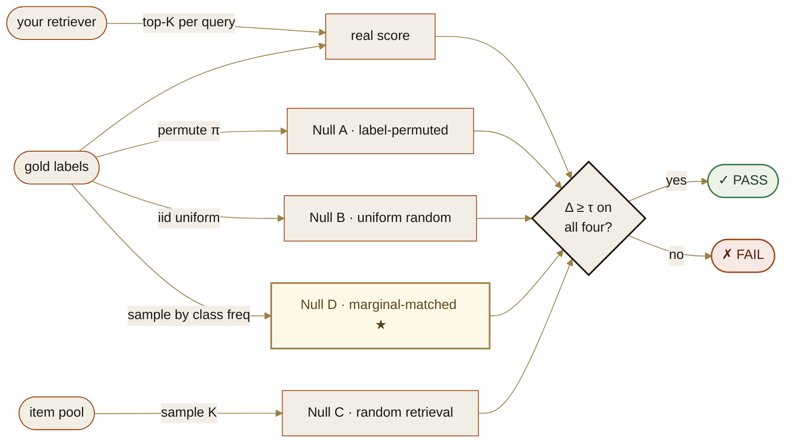

<div align="center">

<picture>
  <source media="(prefers-color-scheme: dark)" srcset="assets/hero-dark.svg">
  
</picture>

<br>

## Some search engines pretend to be smart.

They look like they understand your question.<br>
They actually just return whatever's most popular in their database.

A student named **Mira** would do the same on her French exam.<br>
She'd score 80% by always picking "C". She doesn't speak French.

**This is a 30-second test that catches them.**

```bash
pip install git+https://github.com/spalsh-spec/falsify-eval
```

Free. Open source. Runs on your laptop. Works on any search system.

Built for **search engines, recommendation systems, the retrieval side of RAG.**<br>
*Not* built for the part of ChatGPT that writes paragraphs — that's a different problem we haven't built a test for.

→ **The actual numbers on a real benchmark:** [CS01 — NFCorpus](case_studies/cs01_nfcorpus/CS01_REPORT.md) ·  **5 minutes to reproduce.**

<br>

[](https://github.com/spalsh-spec/falsify-eval/actions/workflows/ci.yml)
[](tests/)
[](https://github.com/spalsh-spec/falsify-eval/releases/latest)
[](https://www.python.org/)
[](LICENSE)

[**30-second demo**](#30-second-demo) · [**The Mira test**](#the-mira-test) · [**How it works**](#how-it-works) · [**Three surfaces**](#three-surfaces) · [**Preprint**](#preprint)

</div>

---

## The Mira test

Imagine a student named Mira who never studied. She noticed that on past exams, *"C"* is the most common correct answer. So she writes *C* every time and scores 80%. She looks smart on paper. She has zero actual knowledge — she gamed the pattern.

A retrieval or ranking system can do the same thing. If the most popular document in a corpus happens to be relevant for most queries, a system that always returns that popular document will score well on aggregate metrics — without using the query at all. (This is not a hypothetical: see the [CS01 NFCorpus case study](case_studies/cs01_nfcorpus/CS01_REPORT.md) where this exact predictor scores nDCG@10 = 0.066 on a published BEIR benchmark while ignoring every query.)

The published number looks great. It does not mean what you think it means.

**falsify-eval is a Mira-check for retrieval and ranking systems.** It compares your system's score against four "fake students" — four null distributions, including one (*Null D*, the marginal-matched random) that is original to this work and that the previous standard nulls miss. If your system can't beat all four by a calibrated margin, the gate fails.

→ **Case studies (real numbers, two public benchmarks):**
  - [CS01 — NFCorpus](case_studies/cs01_nfcorpus/CS01_REPORT.md) (323 BEIR queries, dense relevance ~38 docs/query)
  - [CS02 — SciFact](case_studies/cs02_scifact/CS02_REPORT.md) (300 BEIR queries, sparse relevance ~1.1 docs/query)

  Across both: Mira and popularity-only fail at Δ_D ≈ 0; BM25 and dense MiniLM pass at Δ_D = +0.14 to +0.73. Reproducible in 5 minutes each on M1 laptop. Joint finding: graded metrics (nDCG) on dense-relevance benchmarks can flatten the gate — pair them with single-gold strict metrics (recall@K against top-1).

---

## 30-second demo

```bash
pip install git+https://github.com/spalsh-spec/falsify-eval
python -c "from falsify_eval.demo import run; run()"
```

Three systems graded on a 50-query synthetic bench:

```
═══ constant_predictor (deliberately broken) ═══
  real mean nDCG@5         = 0.20
    Δ_A (gold-permuted)    = +0.000  ✗
    Δ_B (uniform random)   = +0.001  ✗
    Δ_C (random retrieval) = +0.18   ✓
    Δ_D (marginal-matched) = +0.000  ✗  ← the gate that catches Mira
  GATE: ✗ FAIL  (correctly rejected)

═══ mock_engine (plausible retrieval, 70% top-1) ═══
  real mean nDCG@5         = 0.62
    Δ across all 4 nulls   ≥ +0.40   ✓
  GATE: ✓ PASS  (correctly accepted)

═══ oracle (perfect top-1) ═══
  real mean nDCG@5         = 1.00
  GATE: ✓ PASS by maximum margin
```

---

## How it works



| Null | What it tests | Catches |
|---|---|---|
| **A — gold-permuted** | bijection π over class labels | systems that learned label distribution shape, not relevance |
| **B — uniform random** | iid uniform draw of gold per query | systems that exploit class-prior assumption |
| **C — random retrieval** | replace engine output with K random items from pool | systems that score by retrieval coverage, not ranking quality |
| **D — marginal-matched** ★ | iid draw of gold from the empirical class frequency | predictors matched to the gold marginal — *new in this work* |

**Null D is the load-bearing contribution.** It correctly rejects the constant-most-frequent predictor that A and B can false-positive. *(Definition 1 of the [preprint](PREPRINT.md).)*

---

## Three surfaces

```python
# 1. Library
from falsify_eval import four_null_gate

result = four_null_gate(
    retrieved_lists, gold_list, rel_list, my_metric,
    item_pool=corpus_ids, k=5, n_trials=50, tau=0.05,
    progress=True,                      # stderr per-stage timing
)
assert result["gate_passes"]
```

```bash
# 2. CLI on JSONL benches — no Python knowledge needed
falsify-eval grade --input bench.jsonl --metric ndcg@5 --pool corpus.txt
falsify-eval doctor                     # end-to-end install verification
falsify-eval quickstart ./demo          # writes a sample bench + pool
```

```json
// 3. MCP server — Claude Code, Cursor, any MCP-compatible client
{
  "mcpServers": {
    "falsify-eval": {
      "command": "python",
      "args": ["-m", "falsify_eval.mcp_server"]
    }
  }
}
```

Claude can then call `grade_retrieval` directly on any retrieval pipeline output you give it — no glue code, no separate scoring service.

---

## What it catches

A non-exhaustive list of failure modes the gate flags:

| Broken predictor | Δ_A | Δ_B | Δ_C | Δ_D | Gate |
|---|:-:|:-:|:-:|:-:|:-:|
| Constant most-frequent class | ≈ 0 | ≈ 0 | + | **≈ 0** | ✗ |
| Marginal-matched random | ≈ 0 | + | + | **≈ 0** | ✗ |
| Popularity-only ranker (no query feature) | + | + | + | small | ✗ |
| Lexical-match-only on bag-of-words | + | + | + | + | ✓ |
| Full retriever (BM25 / dense / hybrid) | + | + | + | + | ✓ |
| Full retriever on **drifted** corpus | varies | varies | varies | varies | ✗ via `verify_state` |

The first three score well on bare aggregate metrics (nDCG, MRR, recall@K). The standard reporting practice publishes those numbers. The four-null gate rejects them.

---

## What the gate does NOT prove

A passing gate is *necessary* for credible reporting, not *sufficient*. It does not prove:

- the engine learned the actual relevance signal (only that it learned *something* beyond the four trivial null classes)
- the engine generalises beyond the evaluation set
- per-feature contribution claims are significant *(handled separately by `bootstrap_ci`, `paired_permutation_p`, `cohens_d_paired`)*
- the bench developer didn't overfit query phrasing to engine behaviour

The library is **calibrated for retrieval and ranking evaluation** — search, recommendation top-K, RAG retrieval-side, classification-as-retrieval. It is **not yet** generalised to LLM free-text generation, summarisation, or open-ended QA. Those domains need their own null distributions and are planned for v0.3+.

---

## Validating an LLM-RAG pipeline

```python
from falsify_eval import four_null_gate

# Replace this with whatever your retriever returns. The library doesn't
# care if it's BM25, FAISS, Pinecone, Weaviate, Vespa, or a homegrown
# bag-of-words. It grades the OUTPUT, not the engine.
def my_rag_retriever(query: str) -> list[str]:
    """Return top-K document IDs for a query."""
    ...

retrieved = [my_rag_retriever(q) for q in queries]

def recall_at_5(r, g, _rel): return 1.0 if g in r[:5] else 0.0

res = four_null_gate(
    retrieved, gold, [3]*len(gold), recall_at_5,
    item_pool=pool, k=5, n_trials=100, tau=0.05, seed=2026,
)
print("GATE:", "PASS" if res["gate_passes"] else "FAIL", res["deltas"])
```

A complete Claude-API worked example with a 50-query bench is in [`examples/llm_rag_validation.py`](examples/llm_rag_validation.py). To adapt it to GPT-4 / Llama / Mistral / Gemini: swap the API call inside `my_rag_retriever`. The gate is identical.

---

## Why is my run taking so long?

The gate calls your `metric_fn` exactly **N × (1 + 4 × n_trials)** times.

| Metric cost / call | N=500, n_trials=50 |
|---|---|
| In-memory check (~1 µs) | 0.1 s |
| Embedding lookup (~1 ms) | 1.7 min |
| LLM-judge call (~200 ms) | **~5.6 hours** |

If your run is taking hours, your *metric* is the bottleneck — not the gate (which finishes N=5,000 × pool=100k × n_trials=50 in under 2 seconds with a fast metric). Pass `progress=True` to see per-stage timing on stderr. Three options to speed up: (1) drop `n_trials` from 50 → 20 — statistically defensible; (2) cache `metric_fn` calls; (3) parallelise the four nulls with multiprocessing — pure CPU, no shared state.

---

## How this compares

| Capability | DVC | MLflow | W&B | Ragas | TruLens | **falsify-eval** |
|---|:-:|:-:|:-:|:-:|:-:|:-:|
| Vendor-free | ✓ | ✓ | ✗ | ✓ | partial | **✓** |
| Pure-text human-readable lock | ✗ | ✗ | ✗ | ✗ | ✗ | **✓** |
| Couples artifact hash + verified score | ✗ | ✗ | partial | ✗ | partial | **✓** |
| Falsification gate (CI-enforceable) | ✗ | ✗ | ✗ | ✗ | ✗ | **✓** |
| **Marginal-matched null** ★ | ✗ | ✗ | ✗ | ✗ | ✗ | **✓** |
| Positive-control self-validation | ✗ | ✗ | ✗ | ✗ | ✗ | **✓** |

The tools above solve different problems (versioning, tracking, observability). They complement falsify-eval; they don't replace it.

---

<details>
<summary><b>Where it actually runs</b></summary>

Pure Python ≥ 3.10 + numpy ≥ 1.24. No GPUs, no native extensions, no internet at runtime.

| Environment | One-liner |
|---|---|
| Local laptop | `pip install git+https://github.com/spalsh-spec/falsify-eval` |
| Google Colab | `!pip install git+https://github.com/spalsh-spec/falsify-eval` |
| Kaggle / Sagemaker / Databricks | same as Colab |
| GitHub Actions | add the `pip install` line to your `run:` block |
| Docker (any base image with Python ≥ 3.10) | `RUN pip install git+...` |
| AWS Lambda / Cloud Functions | bundle as a layer; the wheel is < 50 KB |
| Air-gapped / offline | clone the repo to a USB stick; install from local path |

The library is intentionally minimal so the audit surface is small and the deployment surface is large. No network calls, no telemetry, no opinions about your runtime.

</details>

<details>
<summary><b>What the gate proves (Proposition 1)</b></summary>

If the four-null gate PASSes (Δ ≥ τ on all four nulls) at N_trials = 50, τ = 0.05, then with Bonferroni-corrected confidence ≥ 0.95:

- The engine is **not** equivalent to a label-permutation-invariant ranker (rejected by *G_A*).
- The engine is **not** achieving its score solely via the uniform-class-prior assumption (rejected by *G_B*).
- The engine is **not** equivalent to a uniform-random retriever (rejected by *G_C*).
- The engine is **not** equivalent to a gold-marginal-matched predictor (rejected by *G_D — new in this work*).

The full proof is in [`PREPRINT.md`](PREPRINT.md), §3.

</details>

<details>
<summary><b>Why we built it</b></summary>

Most retrieval-system papers report a single aggregate metric (nDCG@k, MRR) and call it a contribution. Three failure modes make this practice unsafe at any benchmark size and dangerous on small ones:

1. **Null-distribution silence.** A learned ranker can absorb gold-label distribution shape without learning underlying query–document relevance. A constant predictor matched to the empirical class marginal can score non-trivially without using the query at all.
2. **Corpus drift between commits.** ALTER TABLE migrations and feedback-loop side effects mutate runtime artifacts without changing source code. A "score-neutral" annotation can be true about the source diff while false about the runnable system.
3. **Small-sample claims masquerading as significance.** A +0.02 metric gain on N < 50 queries usually sits inside the bench's noise floor.

The four-null gate addresses (1). The integrity-check state lock (`lock_state` / `verify_state`) addresses (2). The statistical-reporting helpers (`bootstrap_ci`, `paired_permutation_p`, `cohens_d_paired`, `power_n_required`) address (3). All in <1,000 lines of Python with `numpy` as the only runtime dependency.

</details>

---

## Preprint

- [`PREPRINT.md`](PREPRINT.md) — *Calibrated Falsification Harnesses for Retrieval Evaluation* (v7, with N=10,000 validation, broken-predictor suite, sensitivity grid, soundness proposition).
- [`SUPPLEMENTARY.md`](SUPPLEMENTARY.md) — extended tables, ablations, bench-size calibration curve.

Submission to arXiv is pending. The DOI will be added to `CITATION.cff` on acceptance. In the interim, the markdown is the canonical source; both files are immutable for v0.1.0 (verifiable via `lock_state` against the v0.1.0 tag).

```bibtex
@article{sharma2026calibrated,
  title  = {Calibrated Falsification Harnesses for Retrieval Evaluation},
  author = {Sharma, Sparsh},
  year   = {2026},
  eprint = {<arxiv-id-when-published>},
  archivePrefix = {arXiv},
  primaryClass  = {cs.IR}
}
```

---

## Status

- **v0.1.6** — current. **58 tests** passing on a fresh clone (added 11 scipy cross-check tests + 4 hypothesis property-based tests). New `bonferroni()` helper honours the PREPRINT abstract promise of *Bonferroni-corrected paired tests*. **Two real-data case studies published**: [CS01 — NFCorpus](case_studies/cs01_nfcorpus/CS01_REPORT.md) and [CS02 — SciFact](case_studies/cs02_scifact/CS02_REPORT.md). PREPRINT abstract rewritten to drop the *cryptographic* overselling and the AI / retrieval conflation Lewi flagged.
- **v0.1.5.2** — added `progress=True` flag to `four_null_gate` after Mayank's 5-hour Akosh-AI silent-run incident.
- **v0.1.5.1** — closed `null_a` defect class for tuple / dataclass labels.
- **v0.1.5** — fixed all 14 defects from the Mayank Singh adversarial battery; full credit in [`CHANGELOG.md`](CHANGELOG.md).
- **v0.2 (next)** — PyPI publish; case studies CS03 (FiQA) and CS04 (Quora) for metric-sensitivity triangulation; broken-predictor zoo as a public artifact.
- **v0.3+ (planned)** — extension to LLM free-text and summarisation; pre-registration tooling. *(Not yet shipped — do not claim coverage.)*

Issues and PRs welcome. The reference implementation is intentionally minimal; the goal is for the protocol to be small enough that adopters audit the entire library before depending on it.

---

<div align="center">

*A house of standards.*  Released by **[Bhardwaj &amp; Sons](https://bhardwajandsons.com)** under Apache 2.0.<br>
The methodology is free, public, and citable so it can become a standard rather than a product.

</div>
